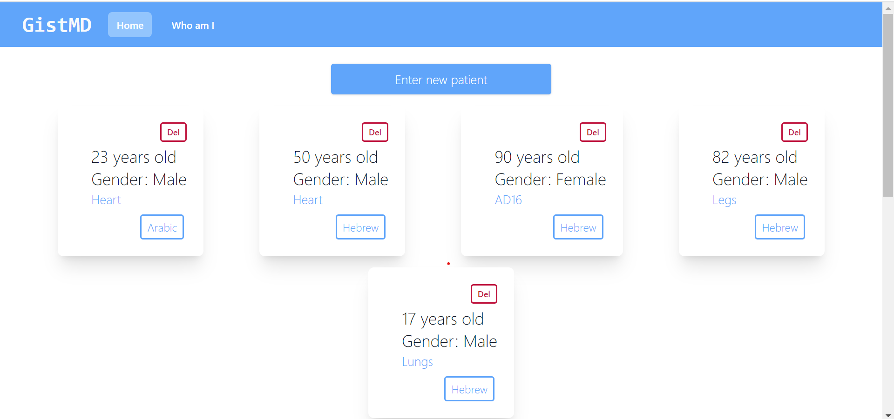
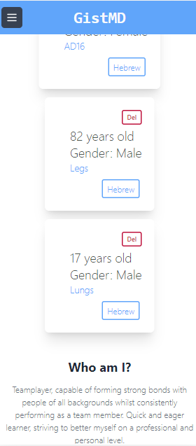
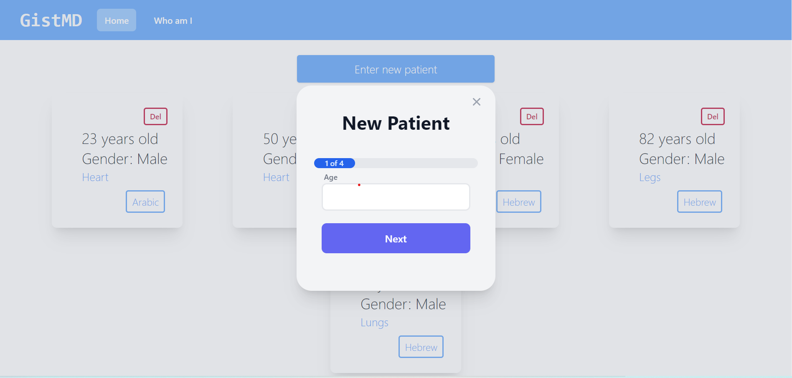
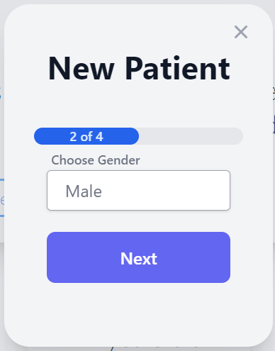
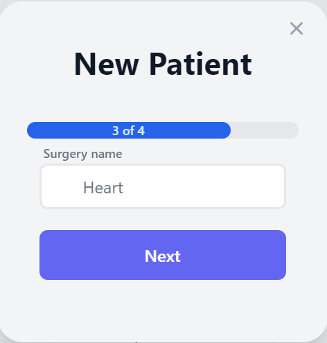
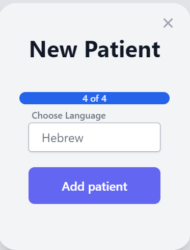
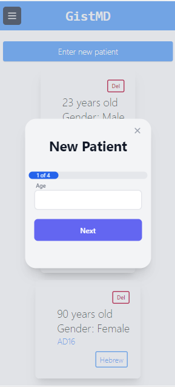

# GistMD Mange Patients Client Repo

## What this repo stands for

Welcome to Manage Patient Client Readme, this app can manage your patients, you are able to see all of your patients, delete each and add a new patient.

## Features

1. See all of your patients.
2. The app is mobile supproted.
3. Delete each of the patient.
4. Add a new patient in onboarding process.

## Technologies

The technoloies I chose to use are:

1. React.JS.

## Instructions

1. Fork this repo into your account.
2. Clone the forked repo to your computer.
3. Run `npm install`.
4. Run the server side.
5. Run `npm run start` for start recicve requsets on client environment.

## Screenshots

### Main screen - All paitents (Regular screen)

### Main screen - All paitents (Mobile screen)

### Add new paitent - (Regular screen)

### Add new paitent - (Mobile screen)

